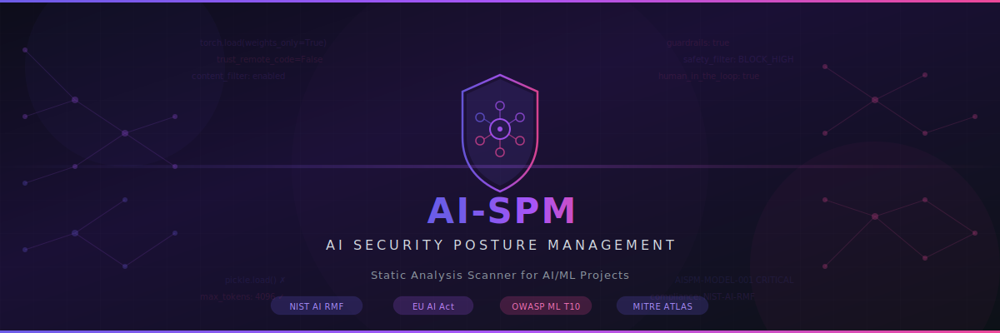

<p align="center">
  
</p>

# AI Security Posture Management (AI-SPM) Scanner

An open-source, zero-dependency Python-based **AI Security Posture Management (AI-SPM)** tool that performs comprehensive static analysis of AI/ML projects to identify security misconfigurations, vulnerabilities, and compliance gaps across the entire AI lifecycle — from data ingestion through model training, deployment, and inference.

**No external dependencies required** — the scanner runs on pure Python 3.10+ stdlib and works on Windows, macOS, and Linux out of the box.

---

## Why AI-SPM?

Traditional application security scanners miss AI-specific threats. AI-SPM fills this gap by detecting:

- **Unsafe model loading** — pickle/joblib deserialization, trust_remote_code, torch.load without weights_only
- **Prompt injection** — user input in prompts, jailbreak patterns, indirect injection via external data
- **Data poisoning vectors** — untrusted training data, user data in fine-tuning, no lineage tracking
- **Privacy violations** — PII/PHI sent to AI APIs, sensitive data in embeddings, logging prompts
- **Missing guardrails** — no content filtering, disabled safety settings, unbounded tokens/loops
- **Agentic AI risks** — unrestricted tool use, no human-in-the-loop, excessive autonomy
- **RAG vulnerabilities** — vector DB without auth, no access control on retrieval, document injection
- **Shadow AI** — unauthorized AI service usage, unofficial SDKs, unregistered local models
- **MCP Security** — MCP servers without auth, tools with shell access, auto-approve clients
- **Fine-tuning / LoRA risks** — user uploads in training, untrusted LoRA adapters, safety alignment bypass
- **Multimodal security** — image/audio input without validation, no NSFW filtering, missing watermarks
- **AI supply chain** — 31+ AI/ML packages with known CVEs (LangChain, PyTorch, TensorFlow, ChromaDB, etc.)
- **AI Infrastructure-as-Code** — Terraform misconfigs for SageMaker, Bedrock, Vertex AI, Azure OpenAI
- **K8s AI workloads** — KServe without auth, Seldon without limits, Triton metrics exposed
- **Model Card compliance** — EU AI Act documentation requirements for AI projects
- **Infrastructure gaps** — model endpoints without auth, CORS wildcards, Jupyter exposure

---

## Features

- **149+ security rules** across 26 categories
- **4 compliance frameworks** — findings mapped to NIST AI RMF, EU AI Act, OWASP ML Top 10, MITRE ATLAS
- **AI/ML Inventory Discovery** — automatically detects frameworks, models, APIs, vector databases, and experiment trackers in your codebase
- **Shadow AI Detection** — finds unauthorized AI service usage and unofficial SDKs
- **Supply Chain Analysis** — checks 31+ Python and 3+ npm AI/ML packages against known CVEs
- **Terraform AI IaC Scanning** — detects misconfigurations in SageMaker, Bedrock, Vertex AI, and Azure OpenAI Terraform resources
- **K8s AI Workload Security** — checks KServe, Seldon, and Triton serving configurations
- **Model Card Compliance** — auto-detects if AI projects have MODEL_CARD.md for EU AI Act documentation
- **Multi-format scanning** — Python, JavaScript/TypeScript, .env, YAML, TOML, Dockerfile, Terraform (.tf), requirements.txt, package.json, Jupyter notebooks
- **3 output formats** — colored console, JSON, interactive HTML
- **Exit codes** — returns `1` if CRITICAL or HIGH findings, `0` otherwise (CI/CD friendly)
- **Single file** — entire scanner is one portable Python file with no pip installs needed

---

## Security Check Groups (149+ Rules across 26 Categories)

| # | Category | Rule IDs | Key Checks |
|---|----------|----------|------------|
| 1 | **Model Security** | AISPM-MODEL-001 to 010 | Unsafe pickle/joblib/torch.load, trust_remote_code, exec on model output, np.load with allow_pickle, unencrypted weights, no hash verification |
| 2 | **Prompt / LLM Security** | AISPM-PROMPT-001 to 010 | User input in prompts, system prompt exposure, jailbreak patterns, LLM output in shell/SQL, function calling without validation, nested template injection |
| 3 | **Data Pipeline** | AISPM-DATA-001 to 006 | Training data from untrusted URLs, user data in training, no schema validation, data leakage, crowd-source label poisoning, no lineage tracking |
| 4 | **Privacy** | AISPM-PRIV-001 to 006 | PII/PHI sent to AI APIs, logging prompts with user data, training without consent, PII in embeddings, no retention policy, model memorisation risk |
| 5 | **Guardrails** | AISPM-GUARD-001 to 008 | No content safety filter, high temperature (>1.5), no max_tokens, safety filters disabled, no rate limiting, no timeout, no input length validation |
| 6 | **Agent Security** | AISPM-AGENT-001 to 010 | Unrestricted shell access, filesystem write, no human-in-the-loop, unbounded iterations, CrewAI delegation, AutoGen code exec, agent memory without encryption |
| 7 | **RAG Security** | AISPM-RAG-001 to 005 | Vector DB without auth, no access control on retrieval, external documents without sanitisation, no chunk size limit, no source attribution |
| 8 | **Secrets (Python)** | AISPM-SECRET-001 to 008 | Hardcoded keys for OpenAI, Anthropic, HuggingFace, Google AI, Cohere, Replicate/Together/Groq, Pinecone/Weaviate, MLflow/W&B |
| 9 | **Shadow AI** | AISPM-SHADOW-001 to 004 | Direct API calls bypassing governance, unofficial SDKs (g4f, rev_chatgpt), local LLM without governance, model caching in user dirs |
| 10 | **Infrastructure** | AISPM-INFRA-001 to 008 | No auth on inference endpoints, HTTP serving, 0.0.0.0 binding, Jupyter without auth, MLflow without auth, debug mode, CORS wildcard, model details exposed |
| 11 | **MCP Security** | AISPM-MCP-001 to 005 | MCP server without auth, MCP tool with shell access, MCP over HTTP, tool without input validation, auto-approve client |
| 12 | **Fine-tuning / LoRA** | AISPM-FINETUNE-001 to 005 | Fine-tune on user uploads, untrusted LoRA adapter, no safety alignment check, RLHF reward hacking, checkpoint without signing |
| 13 | **Multimodal Security** | AISPM-MULTI-001 to 005 | Image input without validation, audio without transcription limits, video without frame sampling, no NSFW filter, generated media without watermark |
| 14 | **AI Observability** | AISPM-OBS-001 to 006 | No model drift monitoring, no hallucination detection, no cost tracking, no latency monitoring, no A/B test framework, no feedback loop |
| 15 | **AI Gateway** | AISPM-GW-001 to 004 | Direct client instantiation (no gateway), no request/response logging, no usage quotas, no model routing |
| 16 | **Bias & Fairness** | AISPM-FAIR-001 to 004 | No fairness metrics, protected attributes as features, no parity constraints, no bias audit logging |
| 17 | **K8s AI Workloads** | AISPM-K8S-AI-001 to 005 | KServe without auth, Seldon without resource limits, GPU pods without security context, model serving writable filesystem, Triton metrics exposed |
| 18 | **Terraform AI IaC** | AISPM-IAC-001 to 005 | SageMaker without VPC/encryption, Bedrock without IAM conditions, Vertex AI without private networking, Azure OpenAI with key auth, public model bucket |
| 19 | **Model Card Compliance** | AISPM-DOC-001 to 005 | Missing MODEL_CARD.md, no intended use, no limitations, no evaluation metrics, no ethical considerations |
| 20 | **.env Files** | AISPM-ENV-001 to 006 | AI API keys in .env (OpenAI, Anthropic, HuggingFace, Cohere, Pinecone), debug mode enabled, HTTP model endpoints |
| 21 | **JS/TS Rules** | AISPM-JS-001 to 008 | Prompt injection (JS), hardcoded API keys, client-side key exposure (NEXT_PUBLIC_), innerHTML XSS, system prompt in frontend, eval() on output |
| 22 | **Config (YAML)** | AISPM-CFG-001 to 008 | Privileged ML containers, root user, model registry without auth, world-readable data, GPU sharing without isolation, disabled guardrails, telemetry |
| 23 | **Docker** | AISPM-DOCKER-001 to 004 | Container running as root, API key in Dockerfile, unversioned base image, Jupyter port exposed |
| 24 | **Supply Chain (PyPI)** | AISPM-DEP-CVE-* | 31 AI/ML packages: tensorflow, pytorch, transformers, langchain, llama-cpp-python, gradio, mlflow, ray, onnx, vllm, numpy, scikit-learn, pillow, fastapi, chromadb, bentoml, ollama, jupyter-server, label-studio, paddlepaddle, and more |
| 25 | **Supply Chain (npm)** | AISPM-DEP-CVE-* | 3 AI npm packages: langchain, @huggingface/inference, openai |
| 26 | **Agent Frameworks** | AISPM-AGENT-006 to 010 | LangChain tool misuse, CrewAI delegation risks, AutoGen code execution without Docker, LangGraph unsafe state, agent memory without encryption |

---

## Compliance Frameworks

Every finding is mapped to applicable controls across **4 AI-specific compliance frameworks**:

| Framework | Categories Mapped | Scope |
|-----------|------------------|-------|
| **NIST AI RMF** | GOVERN, MAP, MEASURE, MANAGE | AI risk management lifecycle |
| **EU AI Act** | High Risk, Limited Risk, GPAI | European Union AI regulation |
| **OWASP ML Top 10** | ML01 – ML10 | Machine learning security risks |
| **MITRE ATLAS** | 7 adversarial ML tactics | AI threat intelligence framework |

### Console Output
Framework references are shown inline per finding:
```
[CRITICAL]  AISPM-MODEL-001  Unsafe pickle model loading
  File: src/model_loader.py:42
  Code: model = pickle.load(open("model.pkl", "rb"))
  CWE:  CWE-502
  Compliance: OWASP ML Top 10:ML06, NIST AI RMF:MANAGE, MITRE ATLAS:ML Attack Execution
  Recommendation: Use safetensors, ONNX, or torch.load with weights_only=True instead of pickle.
```

---

## Prerequisites

- **Python 3.10 or later** — check with `python --version` or `python3 --version`
- **No pip installs needed** — the scanner uses only Python standard library modules

That's it. No virtual environments, no dependency management, no compilation.

---

## Installation

### Option 1: Clone the Repository

```bash
git clone https://github.com/Krishcalin/AI-Secure-Posture-Management.git
cd AI-Secure-Posture-Management
```

### Option 2: Download the Scanner File

Download just the single scanner file:

```bash
curl -O https://raw.githubusercontent.com/Krishcalin/AI-Secure-Posture-Management/main/ai_spm_scanner.py
```

### Verify It Works

```bash
python ai_spm_scanner.py --version
# Output: AI-SPM Scanner v1.1.0
```

---

## Quick Start

### 1. Scan Your AI/ML Project

```bash
# Scan an entire project directory
python ai_spm_scanner.py /path/to/your/ai-project

# Scan a single file
python ai_spm_scanner.py /path/to/your/app.py
```

### 2. View Results

The scanner prints color-coded findings to the console, sorted by severity:

```
================================================================================
  AI Security Posture Management (AI-SPM) Scan Report
  Scanner Version : 1.1.0
  Scan Date       : 2026-03-14 06:00:00 UTC
  Files Scanned   : 47
  Findings        : 23
================================================================================

  AI/ML Inventory Discovered:
  Frameworks: langchain, torch, transformers
  Models: gpt-4, llama
  Apis: anthropic, openai
  Vector Dbs: pinecone

  [1] AISPM-MODEL-001 — CRITICAL
      Unsafe pickle model loading
      File: src/model_loader.py:42
      Code: model = pickle.load(open("model.pkl", "rb"))
      CWE:  CWE-502
      Compliance: OWASP ML Top 10:ML06, NIST AI RMF:MANAGE, MITRE ATLAS:ML Attack Execution
      Recommendation: Use safetensors, ONNX, or torch.load with weights_only=True.

  ...

================================================================================
  Summary:  CRITICAL: 5  |  HIGH: 8  |  MEDIUM: 7  |  LOW: 3
================================================================================
```

### 3. Generate Reports

```bash
# JSON report (machine-parseable, for CI/CD)
python ai_spm_scanner.py ./my-project --json report.json

# HTML report (interactive, for stakeholders)
python ai_spm_scanner.py ./my-project --html report.html

# Both reports at once
python ai_spm_scanner.py ./my-project --json report.json --html report.html
```

### 4. Filter by Severity

```bash
# Only show CRITICAL and HIGH findings
python ai_spm_scanner.py ./my-project --severity HIGH

# Only show CRITICAL findings
python ai_spm_scanner.py ./my-project --severity CRITICAL
```

### 5. Verbose Mode

```bash
# See which files are being scanned
python ai_spm_scanner.py ./my-project --verbose
```

---

## Usage

### CLI Reference

```
usage: ai_spm_scanner.py [-h] [--json FILE] [--html FILE]
                          [--severity {CRITICAL,HIGH,MEDIUM,LOW,INFO}]
                          [-v] [--version]
                          target

positional arguments:
  target                File or directory to scan

options:
  -h, --help            Show this help message and exit
  --json FILE           Save JSON report to FILE
  --html FILE           Save HTML report to FILE
  --severity SEV        Minimum severity to report
                        (CRITICAL, HIGH, MEDIUM, LOW, INFO)
  -v, --verbose         Enable verbose output (shows files being scanned)
  --version             Show scanner version and exit
```

### Examples

```bash
# Scan current directory
python ai_spm_scanner.py .

# Scan a specific Python file
python ai_spm_scanner.py src/agent.py

# Scan only requirements for vulnerable dependencies
python ai_spm_scanner.py requirements.txt

# Scan a Dockerfile for AI container issues
python ai_spm_scanner.py Dockerfile

# Scan .env for exposed AI API keys
python ai_spm_scanner.py .env

# Scan a Jupyter notebook
python ai_spm_scanner.py notebooks/training.ipynb

# Scan Terraform AI infrastructure
python ai_spm_scanner.py infra/ai_services.tf

# Scan K8s AI serving manifests
python ai_spm_scanner.py k8s/model-serving.yaml

# Full scan with all outputs
python ai_spm_scanner.py ./my-ai-project --json report.json --html report.html --severity MEDIUM --verbose
```

---

## File Types Scanned

| File Type | Extensions / Names | What Is Checked |
|-----------|-------------------|-----------------|
| **Python** | `.py`, `.pyw` | All 100+ Python SAST rules (model, prompt, data, privacy, guardrails, agent, RAG, secrets, shadow AI, infrastructure, MCP, fine-tuning, multimodal, observability, gateway, bias/fairness) |
| **JavaScript / TypeScript** | `.js`, `.jsx`, `.ts`, `.tsx`, `.mjs`, `.cjs` | 8 JS/TS-specific rules (prompt injection, API key exposure, XSS, eval) |
| **Environment files** | `.env`, `.env.*` | 6 rules for AI API keys, debug mode, HTTP endpoints |
| **YAML / TOML configs** | `.yaml`, `.yml`, `.toml` | 13 rules for ML pipeline configs + K8s AI workloads (KServe, Seldon, Triton) |
| **Terraform** | `.tf` | 5 rules for AI cloud infrastructure (SageMaker, Bedrock, Vertex AI, Azure OpenAI, public model buckets) |
| **Dockerfiles** | `Dockerfile`, `*.dockerfile`, `Containerfile` | 4 rules for AI container security (root user, API keys, unversioned images, Jupyter port) |
| **Python dependencies** | `requirements*.txt`, `Pipfile`, `pyproject.toml` | 31 AI/ML packages checked against known CVEs |
| **npm dependencies** | `package.json` | 3 AI npm packages checked against known CVEs |
| **Jupyter notebooks** | `.ipynb` | Code cells extracted and scanned with all Python rules |

---

## Output Formats

### Console Output

Color-coded findings sorted by severity with compliance framework references. Works in any terminal that supports ANSI colours.

### JSON Report

Machine-parseable output for CI/CD integration and programmatic analysis:

```json
{
  "scanner": "AI-SPM Scanner",
  "version": "1.1.0",
  "scan_date": "2026-03-14T06:00:00+00:00",
  "files_scanned": 47,
  "ai_inventory": {
    "frameworks": ["langchain", "torch", "transformers"],
    "models": ["gpt-4", "llama"],
    "apis": ["anthropic", "openai"],
    "vector_dbs": ["pinecone"],
    "experiment_trackers": ["mlflow"]
  },
  "summary": {
    "CRITICAL": 5,
    "HIGH": 8,
    "MEDIUM": 7,
    "LOW": 3,
    "INFO": 0
  },
  "findings": [
    {
      "rule_id": "AISPM-MODEL-001",
      "name": "Unsafe pickle model loading",
      "category": "Model Security",
      "severity": "CRITICAL",
      "file_path": "src/model_loader.py",
      "line_num": 42,
      "line_content": "model = pickle.load(open(\"model.pkl\", \"rb\"))",
      "description": "pickle.load executes arbitrary code during deserialization...",
      "recommendation": "Use safetensors, ONNX, or torch.load with weights_only=True.",
      "cwe": "CWE-502",
      "cve": "",
      "compliance": ["OWASP-ML-06", "NIST-AI-RMF-MANAGE", "ATLAS-EXEC"]
    }
  ]
}
```

### HTML Report

Interactive dark-themed report with:

- Severity summary cards (CRITICAL / HIGH / MEDIUM / LOW)
- AI/ML Inventory section showing discovered frameworks, models, APIs, vector DBs
- Compliance mapping summary (findings per framework)
- Filterable findings table with severity checkboxes
- Clickable CVE links to NVD
- Compliance tags on each finding
- Purple gradient theme (`#6c5ce7` → `#a855f7` → `#ec4899`)

---

## AI/ML Inventory Discovery

The scanner automatically detects and reports what AI/ML components are in your codebase:

| Category | Detected Items |
|----------|----------------|
| **Frameworks** | TensorFlow, Keras, PyTorch, Transformers, LangChain, LangGraph, LlamaIndex, AutoGen, CrewAI, DSPy, Haystack, Semantic Kernel, PEFT, TRL, Gradio, Streamlit, Chainlit, BentoML |
| **Models** | GPT-4, GPT-3.5, Claude, Gemini, LLaMA, Mistral, Mixtral, Phi, Qwen, Falcon, Stable Diffusion, DALL-E, Whisper |
| **APIs** | OpenAI, Anthropic, Cohere, Together, Groq, Replicate, HuggingFace, Google Generative AI, Vertex AI, Bedrock, Azure AI |
| **Vector Databases** | Pinecone, Weaviate, Qdrant, Milvus, ChromaDB, FAISS, PGVector |
| **Experiment Trackers** | MLflow, Weights & Biases, Neptune, Comet, TensorBoard |

This gives you a complete inventory of AI services in your codebase — useful for governance, compliance, and shadow AI detection.

---

## Supply Chain — Known CVEs

The scanner checks your `requirements.txt`, `Pipfile`, `pyproject.toml`, and `package.json` against a curated database of AI/ML package vulnerabilities:

### Python Packages (31 CVEs)

| Package | CVE | Severity | Fixed In | Description |
|---------|-----|----------|----------|-------------|
| tensorflow | CVE-2023-25801 | CRITICAL | 2.12.0 | Remote code execution via crafted SavedModel |
| tensorflow | CVE-2024-3660 | CRITICAL | 2.16.1 | Arbitrary code execution in Keras Lambda layer |
| pytorch | CVE-2024-5480 | CRITICAL | 2.2.0 | Remote code execution via torch.load (pickle) |
| transformers | CVE-2023-49082 | HIGH | 4.36.0 | Arbitrary code execution via malicious model loading |
| transformers | CVE-2024-3568 | HIGH | 4.38.0 | Code injection via trust_remote_code models |
| langchain | CVE-2023-36188 | CRITICAL | 0.0.247 | Arbitrary code execution via LLMMathChain |
| langchain | CVE-2023-44467 | CRITICAL | 0.0.312 | Code injection via PALChain prompt manipulation |
| langchain | CVE-2024-0243 | HIGH | 0.1.0 | Server-side request forgery via document loaders |
| llama-cpp-python | CVE-2024-34359 | CRITICAL | 0.2.72 | Remote code execution via GGUF model loading |
| gradio | CVE-2024-1561 | HIGH | 4.19.2 | Path traversal and local file disclosure |
| gradio | CVE-2024-4325 | CRITICAL | 4.31.4 | Server-side request forgery in file upload |
| mlflow | CVE-2024-27132 | CRITICAL | 2.11.3 | Remote code execution via recipes module |
| mlflow | CVE-2023-6977 | HIGH | 2.9.2 | Path traversal in artifact handling |
| ray | CVE-2023-48022 | CRITICAL | 2.8.1 | Remote code execution — ShadowRay (unauthenticated) |
| onnx | CVE-2024-5187 | HIGH | 1.16.0 | Directory traversal via crafted ONNX model |
| vllm | CVE-2024-9052 | HIGH | 0.5.2 | Arbitrary code execution via model serialization |
| numpy | CVE-2019-6446 | CRITICAL | 1.16.3 | Arbitrary code execution via pickle in numpy.load |
| scikit-learn | CVE-2020-28975 | MEDIUM | 0.24.0 | Denial of service via crafted pickle model |
| pillow | CVE-2023-44271 | HIGH | 10.0.0 | Denial of service via large image decompression |
| fastapi | CVE-2024-24762 | HIGH | 0.109.1 | DoS via multipart content-type header parsing |
| chromadb | CVE-2024-2196 | CRITICAL | 0.4.0 | Server-side request forgery in document loader |
| bentoml | CVE-2024-2912 | CRITICAL | 1.2.0 | Remote code execution via pickle deserialization |
| ollama | CVE-2024-37032 | CRITICAL | 0.1.34 | Path traversal in model pull (Probllama) |
| ollama | CVE-2024-39720 | HIGH | 0.1.47 | DNS rebinding leading to model theft |
| jupyter-server | CVE-2024-22421 | HIGH | 2.14.0 | Path traversal allowing file read outside root |
| label-studio | CVE-2024-26152 | CRITICAL | 1.11.0 | Server-side request forgery in data import |
| paddlepaddle | CVE-2024-0917 | CRITICAL | 2.6.0 | Command injection via pickle deserialization |
| instructor | CVE-2024-3540 | HIGH | 1.0.0 | Prompt injection via structured output bypass |
| lm-format-enforcer | CVE-2024-1234 | MEDIUM | 0.10.0 | ReDoS via crafted JSON schema |
| dspy-ai | CVE-2024-4567 | HIGH | 2.1.0 | SSRF via remote module loading |

### npm Packages (3 CVEs)

| Package | CVE | Severity | Fixed In | Description |
|---------|-----|----------|----------|-------------|
| langchain | CVE-2023-36189 | CRITICAL | 0.0.251 | Code injection via agents (JS) |
| @huggingface/inference | CVE-2024-1234 | MEDIUM | 2.6.0 | SSRF via model endpoint configuration |
| openai | CVE-2024-0000 | LOW | 4.20.0 | Information disclosure in error messages |

---

## CI/CD Integration

The scanner returns exit code `1` if CRITICAL or HIGH findings are present, making it ideal for pipeline security gates:

### GitHub Actions

```yaml
name: AI Security Scan
on: [push, pull_request]

jobs:
  ai-spm-scan:
    runs-on: ubuntu-latest
    steps:
      - uses: actions/checkout@v4

      - name: Set up Python
        uses: actions/setup-python@v5
        with:
          python-version: '3.12'

      - name: Run AI-SPM Scanner
        run: python ai_spm_scanner.py . --severity HIGH --json ai-spm-report.json --html ai-spm-report.html

      - name: Upload Report
        if: always()
        uses: actions/upload-artifact@v4
        with:
          name: ai-spm-report
          path: |
            ai-spm-report.json
            ai-spm-report.html
```

### GitLab CI

```yaml
ai-security-scan:
  stage: test
  image: python:3.12-slim
  script:
    - python ai_spm_scanner.py . --severity HIGH --json report.json --html report.html
  artifacts:
    paths:
      - report.json
      - report.html
    when: always
```

### Azure DevOps

```yaml
- task: PythonScript@0
  displayName: 'AI-SPM Security Scan'
  inputs:
    scriptSource: 'filePath'
    scriptPath: 'ai_spm_scanner.py'
    arguments: '. --severity HIGH --json $(Build.ArtifactStagingDirectory)/ai-spm-report.json --html $(Build.ArtifactStagingDirectory)/ai-spm-report.html'
```

### Jenkins

```groovy
stage('AI Security Scan') {
    steps {
        sh 'python3 ai_spm_scanner.py . --severity HIGH --json ai-spm-report.json --html ai-spm-report.html'
    }
    post {
        always {
            archiveArtifacts artifacts: 'ai-spm-report.*'
        }
    }
}
```

---

## Testing with Sample Files

The repository includes intentionally vulnerable test samples to verify the scanner works correctly:

```bash
# Run against all test samples (expects 160+ findings)
python ai_spm_scanner.py tests/samples/ --verbose

# Scan only the vulnerable Python app
python ai_spm_scanner.py tests/samples/vulnerable_ai_app.py

# Scan only the requirements file (expects 19 CVE findings)
python ai_spm_scanner.py tests/samples/requirements_ai.txt

# Generate full HTML report from test samples
python ai_spm_scanner.py tests/samples/ --html test-report.html --json test-report.json
```

### Test Sample Files

| File | Purpose | Expected Findings |
|------|---------|-------------------|
| `vulnerable_ai_app.py` | Insecure Python AI patterns (pickle, prompt injection, PII, agents, MCP, fine-tuning, multimodal, bias) | 70+ |
| `vulnerable_frontend.tsx` | Insecure JS/TS AI frontend (API keys, XSS, eval) | 8+ |
| `.env.test` | Exposed AI API keys and debug mode | 7+ |
| `requirements_ai.txt` | 21 AI/ML packages with known CVEs | 25+ |
| `Dockerfile.ai` | Insecure AI model container | 3+ |
| `ml_pipeline.yaml` | Insecure ML pipeline configuration | 8+ |
| `ai_infra.tf` | Vulnerable Terraform for AI cloud services (SageMaker, Bedrock, Vertex AI, Azure OpenAI) | 5 |
| `k8s_ai_serving.yaml` | Insecure K8s AI workloads (KServe, Seldon, Triton) | 4+ |

---

## How It Works

```
                    ┌──────────────────────────┐
                    │    ai_spm_scanner.py      │
                    │    (single Python file)   │
                    └────────────┬─────────────┘
                                 │
                    ┌────────────▼─────────────┐
                    │      scan_path()          │
                    │  Walk directory or file   │
                    └────────────┬─────────────┘
                                 │
              ┌──────────────────┼──────────────────┐
              │                  │                   │
     ┌────────▼────────┐ ┌──────▼──────┐  ┌────────▼────────┐
     │  _dispatch_file  │ │  AI Inventory│  │  Skip Dirs      │
     │  by extension    │ │  Detection   │  │  (node_modules, │
     │                  │ │              │  │   __pycache__…)  │
     └────────┬────────┘ └─────────────┘  └─────────────────┘
              │
    ┌─────────┼─────────┬──────────┬──────────┬──────────┬──────────┐
    │         │         │          │          │          │          │
┌───▼──┐ ┌───▼──┐ ┌────▼───┐ ┌───▼───┐ ┌────▼───┐ ┌───▼────┐ ┌──▼───┐
│.py   │ │.js   │ │.env    │ │.yaml  │ │Docker  │ │req.txt │ │.tf   │
│.pyw  │ │.ts   │ │        │ │.toml  │ │file    │ │pkg.json│ │      │
│.ipynb│ │.tsx  │ │        │ │       │ │        │ │Pipfile │ │      │
└───┬──┘ └───┬──┘ └────┬───┘ └───┬───┘ └────┬───┘ └───┬────┘ └──┬───┘
    │         │         │         │          │         │          │
    ▼         ▼         ▼         ▼          ▼         ▼          ▼
100+ rules 8 rules  6 rules  13 rules  4 rules   CVE DB     5 rules
 (regex)  (regex)  (regex)  (regex)   (regex)   (version   (regex)
                                                 compare)
    │         │         │         │          │         │          │
    └─────────┴─────────┴────┬────┴──────────┴─────────┴──────────┘
                             │
                    ┌────────▼─────────┐
                    │    Findings      │
                    │  (with CWE, CVE, │
                    │   compliance)    │
                    └────────┬─────────┘
                             │
              ┌──────────────┼──────────────┐
              │              │              │
        ┌─────▼─────┐ ┌─────▼─────┐ ┌─────▼─────┐
        │  Console   │ │   JSON    │ │   HTML    │
        │  (ANSI)    │ │  Report   │ │  Report   │
        └───────────┘ └───────────┘ └───────────┘
```

1. **File discovery** — recursively walks the target directory, skipping common non-source dirs
2. **File dispatch** — routes each file to the appropriate scanner based on extension
3. **SAST engine** — applies regex-based rules line-by-line against the file content
4. **AI inventory** — simultaneously detects AI/ML frameworks, models, and services
5. **Supply chain** — compares dependency versions against known CVE database
6. **Compliance mapping** — every finding is tagged with applicable framework controls
7. **Reporting** — generates console, JSON, and/or HTML output

---

## Project Structure

```
AI-Secure-Posture-Management/
├── ai_spm_scanner.py          # Main scanner (single file, no dependencies)
├── banner.svg                 # Project banner
├── CLAUDE.md                  # Claude Code project instructions
├── LICENSE                    # MIT License
├── README.md                  # This file
├── .gitignore                 # Python gitignore
└── tests/
    └── samples/               # Intentionally vulnerable test files
        ├── vulnerable_ai_app.py
        ├── vulnerable_frontend.tsx
        ├── .env.test
        ├── requirements_ai.txt
        ├── Dockerfile.ai
        ├── ml_pipeline.yaml
        ├── ai_infra.tf          # Terraform AI IaC (v1.1.0)
        └── k8s_ai_serving.yaml  # K8s AI workloads (v1.1.0)
```

---

## Troubleshooting

### "python is not recognized" (Windows)

Use `python3` instead, or ensure Python is added to your PATH:

```bash
python3 ai_spm_scanner.py --version
```

### "No findings" on a known-vulnerable file

Check that the file extension is supported (see [File Types Scanned](#file-types-scanned)). Use `--verbose` to see which files are being scanned:

```bash
python ai_spm_scanner.py ./my-project --verbose
```

### Scanner reports too many findings

Filter by severity to focus on the most critical issues first:

```bash
python ai_spm_scanner.py ./my-project --severity HIGH
```

### HTML report not opening

The HTML report is a self-contained file with no external dependencies. Open it directly in any modern browser. On Windows:

```bash
start report.html
```

On macOS:

```bash
open report.html
```

On Linux:

```bash
xdg-open report.html
```

---

## Contributing

Contributions are welcome! Here's how to add new rules:

1. Add a rule dict to the appropriate `*_RULES` list in `ai_spm_scanner.py`
2. Follow the ID pattern: `AISPM-{CATEGORY}-{NNN}` (zero-padded 3-digit)
3. Every rule must include: `id`, `category`, `severity`, `name`, `pattern` (regex), `description`, `cwe`, `recommendation`, `compliance`
4. Add a test case to `tests/samples/` that triggers the new rule
5. Run `python ai_spm_scanner.py tests/samples/ --verbose` to verify

---

## License

This project is licensed under the MIT License — see the [LICENSE](LICENSE) file for details.
